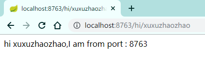

# 创建eureka服务提供者模块【eureka-hi】

### 1、引入pom文件
```xml
<?xml version="1.0" encoding="UTF-8"?>
<project xmlns="http://maven.apache.org/POM/4.0.0" xmlns:xsi="http://www.w3.org/2001/XMLSchema-instance"
         xsi:schemaLocation="http://maven.apache.org/POM/4.0.0 https://maven.apache.org/xsd/maven-4.0.0.xsd">
    <modelVersion>4.0.0</modelVersion>
    <artifactId>eureka-hi</artifactId>
    <version>0.0.1-SNAPSHOT</version>
    <name>eureka-hi</name>
    <description>Demo project for Spring Boot</description>

    <!-- 父工程的依赖 -->
    <parent>
        <groupId>top.xuxuzhaozhao</groupId>
        <artifactId>springcloud_hzadmin</artifactId>
        <version>1.0-SNAPSHOT</version>
    </parent>

    <dependencies>

    </dependencies>
</project>
```
同时要把此模块引入父级pom中
```xml
<!-- 子模块 -->
<modules>
    <module>eureka</module>
    <module>eureka-hi</module>
</modules>
```

### 2、修改配置文件
```yaml
# 端口号
server:
  port: 8763
# 服务名称，即serviceId
spring:
  application:
    name: service-hi
# 服务注册与发现相关配置
eureka:
  client:
    # 服务注册地址
    serviceUrl:
      defaultZone: http://localhost:8761/eureka/

```

### 3、修改main
```java
@RestController
@SpringBootApplication
@EnableEurekaClient
public class EurekaHiApplication {

    public static void main(String[] args) {
        SpringApplication.run(EurekaHiApplication.class, args);
    }

    @Value("${server.port}")
    String port;

    @GetMapping("hi/{name}")
    public String home(@PathVariable String name) {
        return "hi " + name + ",I am from port : " + port;
    }
}
```
