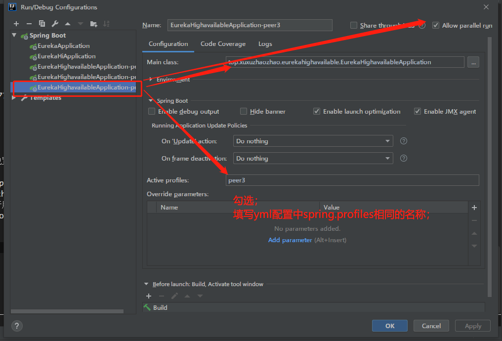
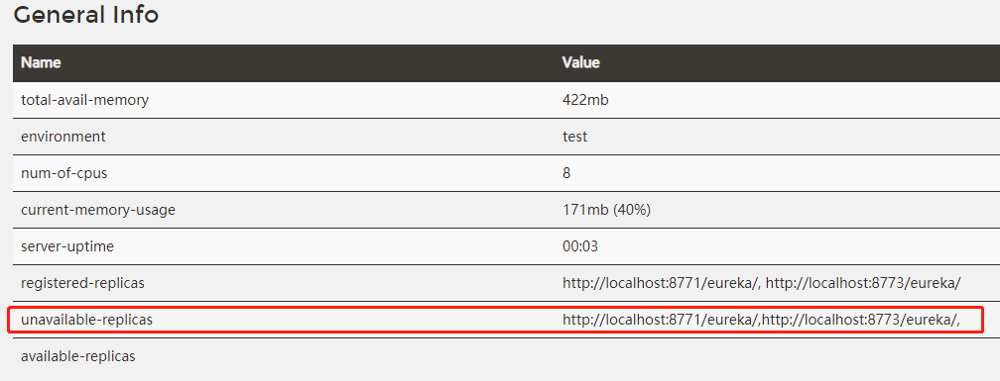
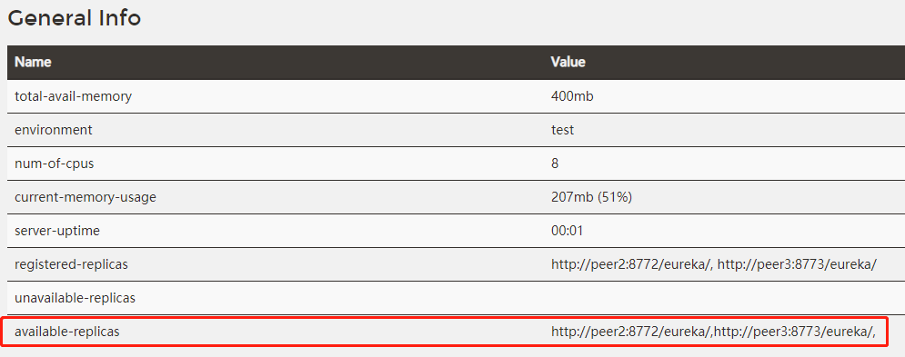
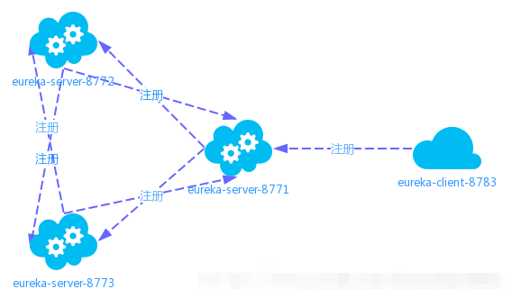

# 创建eureka-highavailble高可用
### 1、为什么要使用高可用

这种配置方式有以下致命缺陷：
- 当成千上万的服务提供者都向它单节点的服务注册中心进行注册时，它的负载是非常高的。
- 一旦这个单节点的服务注册中心挂掉，则所有服务提供者的注册信息都将变得不可用。

### 2、引入pom
跟单节点一样只要引入父级pom
```xml
<?xml version="1.0" encoding="UTF-8"?>
<project xmlns="http://maven.apache.org/POM/4.0.0" xmlns:xsi="http://www.w3.org/2001/XMLSchema-instance"
         xsi:schemaLocation="http://maven.apache.org/POM/4.0.0 https://maven.apache.org/xsd/maven-4.0.0.xsd">
    <modelVersion>4.0.0</modelVersion>

    <artifactId>eureka-highavailable</artifactId>
    <version>0.0.1-SNAPSHOT</version>
    <name>eureka-highavailable</name>
    <description>Demo project for Spring Boot</description>

    <properties>
        <java.version>1.8</java.version>
    </properties>

    <!-- 父工程的依赖 -->
    <parent>
        <groupId>top.xuxuzhaozhao</groupId>
        <artifactId>springcloud_hzadmin</artifactId>
        <version>1.0-SNAPSHOT</version>
    </parent>

    <dependencies>

        <dependency>
            <groupId>org.junit.jupiter</groupId>
            <artifactId>junit-jupiter</artifactId>
            <version>RELEASE</version>
            <scope>test</scope>
        </dependency>
    </dependencies>
</project>
```
同时要把此模块引入父级pom中
```xml
<!-- 子模块 -->
<modules>
    <module>eureka</module>
    <module>eureka-hi</module>
    <module>eureka-highavailable</module>
</modules>
```

### 3、配置
```yaml

---

#高可用节点1的配置
server:
  port: 8771
spring:
  #节点1的标签
  profiles: peer1
  #服务名保持一致
  application:
    name: eureka-highavailable

eureka:
  instance:
    hostname: peer1
  client:
    service-url:
      defaultZone: http://localhost:8772/eureka/,http://localhost:8773/eureka/

---

#高可用节点2的配置
server:
  port: 8772
spring:
  #节点1的标签
  profiles: peer2
  #服务名保持一致
  application:
    name: eureka-highavailable

eureka:
  instance:
    hostname: peer2
  client:
    service-url:
      defaultZone: http://localhost:8771/eureka/,http://localhost:8773/eureka/

---

#高可用节点3的配置
server:
  port: 8773
spring:
  #节点1的标签
  profiles: peer3
  #服务名保持一致
  application:
    name: eureka-highavailable

eureka:
  instance:
    hostname: peer3
  client:
    service-url:
      defaultZone: http://localhost:8771/eureka/,http://localhost:8772/eureka/

  ---
```
代码重点：

- 在yml文件中，通过`---`来区分多个文件，减少配置文件个数。
- 高可用配置中的节点，每个节点的端口号不同
- 高可用配置中的节点，所有节点的服务名相同，即spring.application.name相同
- 高可用配置中的节点，默认情况下，registerWithEureka: true、fetchRegistry: true
- 高可用配置中的节点，需要向除自己之外的节点进行服务注册
- 高可用配置中，设置了每个节点的标签spring.profiles，通过此标签来区分到底启动哪个配置页。

### 4、启动三节点eureka



注意：在分别启用三个节点后，各节点均出现在`unavailable-replicas`中


这是因为主机名不能为**localhost**

#### 解决方法：
- 更改host文件
```text
127.0.0.1	peer1
127.0.0.1	peer2
127.0.0.1	peer3
```

- 修改yml配置
```yaml
eureka:
  instance:
    hostname: peer1
  client:
    service-url:
      defaultZone: http://peer2:8772/eureka/,http://peer3:8773/eureka/

# 其他两个对应修改
```

重新启动：访问`http://peer1:8871`



### 5、创建eureka-highavailable服务提供者

其他创建方法跟eureka-hi相同
配置文件：
```yaml
server:
  port: 8783
spring:
  application:
    name: eureka-highavailable-hi

eureka:
  client:
    service-url:
      # 只需注册其中一个即可，其他注册中心会同步客户端记录信息
      defaultZone: http://peer1:8771/eureka/

```
创建开启后
它的注册信息，即会被同步到其他注册中心，即使其中一个宕机了，也不会影响！

