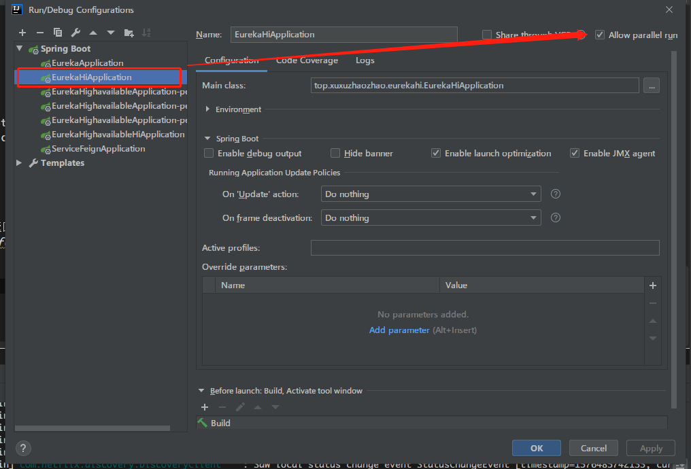
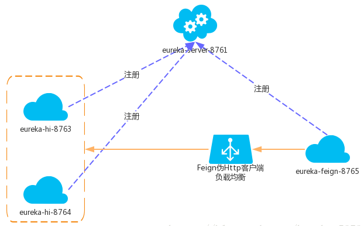

# 创建服务的消费者

> 消费者可以去调用那些注册到注册中心的服务提供者

### 1、引入pom包
```xml
<!-- 父工程的依赖 -->
<parent>
    <groupId>top.xuxuzhaozhao</groupId>
    <artifactId>springcloud_hzadmin</artifactId>
    <version>1.0-SNAPSHOT</version>
</parent>

<dependencies>
    <dependency>
        <groupId>org.springframework.cloud</groupId>
        <!--spring boot 2.0.3版本解决方案：spring-cloud-starter-feign-->
        <artifactId>spring-cloud-starter-openfeign</artifactId>
    </dependency>
</dependencies>
```

### 2、启用Feign客户端
```java
@SpringBootApplication
@EnableFeignClients //启用feign客户端
public class ServiceFeignApplication {

    public static void main(String[] args) {
        SpringApplication.run(ServiceFeignApplication.class, args);
    }
}
```

### 3、创建伪http客户端接口
remote->ServiceHi.java
```java
// 指定eureka服务提供者模块的【spring.application.name】
@FeignClient(value = "service-hi")
public interface ServiceHi {

    // 通过Feign伪Http客户端调用service-hi提供的服务
    @GetMapping("/hi/{name}")
    String sayHiFromServiceHi(@PathVariable(value = "name")String name);
}
```

### 4、创建控制器
```java
@RestController
public class HiController {

    @Autowired
    private ServiceHi serviceHi;

    @GetMapping("/hello/{name}")
    public String sayHi(@PathVariable String name){
        return serviceHi.sayHiFromServiceHi(name);
    }
}
```

此时通过发送请求
`http://localhost:8765/hello/world`即可返回服务提供者执行的数据


### 5、测试负载均衡
启用多个服务提供者
- 修改Idea配置


- 修改server.port=8764再启动

- 此时通过发送第一次请求


- 发送第二次请求


#### 拓扑图如下

