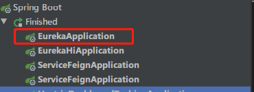
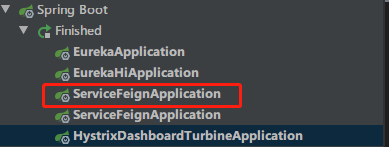

# Hystrix服务熔断及Feign-Hystrix的使用

> 1.断路器机制
>
> 断路器很好理解, 当Hystrix Command请求后端服务失败数量超过一定比例(默认50%), 断路器会切换到开路状态(Open). 这时所有请求会直接失败而不会发送到后端服务. 断路器保持在开路状态一段时间后(默认5秒), 自动切换到半开路状态(HALF-OPEN). 这时会判断下一次请求的返回情况, 如果请求成功, 断路器切回闭路状态(CLOSED), 否则重新切换到开路状态(OPEN). Hystrix的断路器就像我们家庭电路中的保险丝, 一旦后端服务不可用, 断路器会直接切断请求链, 避免发送大量无效请求影响系统吞吐量, 并且断路器有自我检测并恢复的能力.
>
>2.Fallback
>
>Fallback相当于是降级操作. 对于查询操作, 我们可以实现一个fallback方法, 当请求后端服务出现异常的时候, 可以使用fallback方法返回的值. fallback方法的返回值一般是设置的默认值或者来自缓存.
>
>3.资源隔离
>
>在Hystrix中, 主要通过线程池来实现资源隔离. 通常在使用的时候我们会根据调用的远程服务划分出多个线程池. 例如调用产品服务的Command放入A线程池, 调用账户服务的Command放入B线程池. 这样做的主要优点是运行环境被隔离开了. 这样就算调用服务的代码存在bug或者由于其他原因导致自己所在线程池被耗尽时, 不会对系统的其他服务造成影响. 但是带来的代价就是维护多个线程池会对系统带来额外的性能开销. 如果是对性能有严格要求而且确信自己调用服务的客户端代码不会出问题的话, 可以使用Hystrix的信号模式(Semaphores)来隔离资源.

### 1、直接在`service-feign`中修改配置文件
```yaml
feign:
  hystrix:
    enabled: true
```

### 2、降级后需要调用的类
接口 `HiHystrixService`
```java

// 当服务提供者中止运行后，将降级调用fallback指向的类中实现的方法
@FeignClient(value = "service-hi",fallback = HiHystrixServiceImpl.class)
public interface HiHystrixService {

    @GetMapping("/hi/{name}")
    String sayHiFromServiceHi(@PathVariable(value = "name")String name);
}
```

```java
// 当服务提供者中止运行后，将降级调用此方法
@Component
public class HiHystrixServiceImpl implements HiHystrixService {
    @Override
    public String sayHiFromServiceHi(String name) {
        return "hello" + name +", this message send failed";
    }
}
```

### 3、测试降级
- 启动注册中心eureka：http://localhost:8761/



- 不要启动服务提供者eureka-hi

- 启动消费者service-feign：http://localhost:8765/



- 访问 http://localhost:8765/hello/xuxuzhaozhao

此时，将不会返回服务提供者的方法，而是直接返回降级后的方法

`hello xuxuzhaozhao, this message send failed`