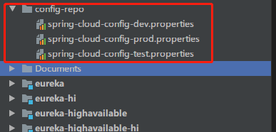

# Spring Cloud Config配置中心

> 每个项目都会有很多的配置文件，如果采用分布式的开发模式，需要的配置文件随着服务增加而不断增多。配置中心便是解决此类问题的灵丹妙药。

Spring Cloud Config核心功能：

- 提供服务端和客户端支持
- 集中管理各环境的配置文件
- 配置文件修改之后，可以快速的生效
- 可以进行版本管理
- 支持大的并发查询
- 支持各种语言

Spring Cloud Config项目是一个解决分布式系统的配置管理方案。

- 它包含了Client和Server两个部分：
- Server提供配置文件的存储、以接口的形式将配置文件的内容提供出去；
- Client通过接口获取数据、并依据此数据初始化自己的应用。
- Spring cloud使用git或svn存放配置文件，默认情况下使用git。

### 1、创建自己的配置仓库文件



每个配置文件中都写入一条： `config.hello=hello Im dev/test/pro`

### 2、创建config-server端
引入pom
```xml
<!-- 父工程的依赖 -->
<parent>
    <groupId>top.xuxuzhaozhao</groupId>
    <artifactId>springcloud_hzadmin</artifactId>
    <version>1.0-SNAPSHOT</version>
</parent>

<dependencies>
    <dependency>
        <groupId>org.springframework.cloud</groupId>
        <artifactId>spring-cloud-config-server</artifactId>
    </dependency>
</dependencies>
```
### 3、修改配置文件
```yaml
server:
  port: 8769
spring:
  application:
    name: spring-cloud-config-server
  cloud:
    config:
      server:
        git:
          uri: https://github.com/xuxuzhaozhao2015/springcloud-hzadmin.git
          search-paths: config-repo
          username: xxxxxx
          password: xxxxxx
```
Spring Cloud Config也提供本地存储配置的方式。
- 只需要设置属性spring.profiles.active=native，Config Server会默认从应用的src/main/resource目录下检索配置文件。
- 也可以通过spring.cloud.config.server.native.searchLocations=file:E:/properties/属性来指定配置文件的位置。

### 4、修改启动类
```java
@SpringBootApplication
@EnableConfigServer
public class ConfigServerApplication {
    public static void main(String[] args) {
        SpringApplication.run(ConfigServerApplication.class, args);
    }
}
```

启动后访问：http://localhost:8769/spring-cloud-config-dev.properties


 
 ### 5、配置config-client端
 引入pom
 ```xml
<!-- 父工程的依赖 -->
<parent>
    <groupId>top.xuxuzhaozhao</groupId>
    <artifactId>springcloud_hzadmin</artifactId>
    <version>1.0-SNAPSHOT</version>
</parent>

<dependencies>
    <dependency>
        <groupId>org.springframework.cloud</groupId>
        <artifactId>spring-cloud-config-client</artifactId>
    </dependency>
</dependencies>
```
修改配置文件 `application.properties`
```properties
server.port=8771
spring.application.name=spring-cloud-config-client
```
增加配置文件 `bootstrap.properties`
```properties
# spring-cloud相关的属性必须配置在bootstrap.properties中，config部分内容才能被正确加载。
spring.cloud.config.name=spring-cloud-config
spring.cloud.config.profile=dev
spring.cloud.config.uri=http://localhost:8769/
spring.cloud.config.label=master
```

测试controller
```java
@RestController
public class HelloController {

    @Value("${config.hello}")
    private String hello;

    @GetMapping("/hello")
    public String hello(){
        return hello;
    }
}
```

直接访问：http://localhost:8771/hello

